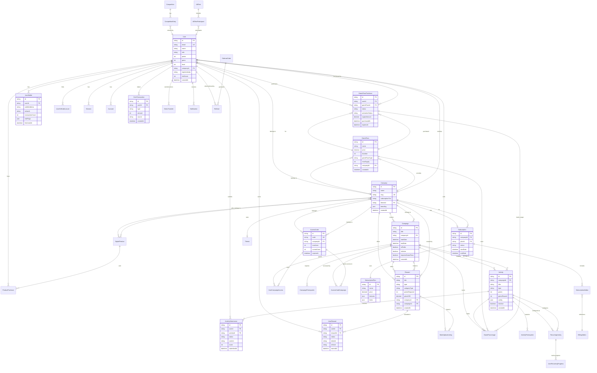

# Arquitectura de Base de Datos - VW Activities Platform

## Diagrama Entidad-Relación



## Tablas Principales

### 1. Gestión de Usuarios y Autenticación

#### User
- **Descripción**: Usuario principal del sistema con sistema multi-rol
- **Roles**: SUPER_ADMIN, COMPANY_ADMIN, CAMPAIGN_CREATOR, END_USER
- **Gamificación**: points, gems, level, vipTier
- **Seguridad Anti-Bot**: registrationIp, riskScore, suspensionReason
- **Índices Críticos**: companyId, role, isActive, registrationIp, riskScore

#### Session
- **Descripción**: Gestión de sesiones con NextAuth.js
- **Índices**: userId, expires (para limpieza automática)

#### Account
- **Descripción**: Cuentas OAuth vinculadas (Google, GitHub, etc.)
- **Índice único**: [provider, providerAccountId]

#### UserWallet
- **Descripción**: Sistema anti-multicuentas - tracking de wallets blockchain
- **Campos clave**: walletAddress, network, transactionCount, riskFlags
- **Índices críticos**: walletAddress, [walletAddress, network]

#### UserGitHubAccount
- **Descripción**: Vinculación de cuentas GitHub con OAuth
- **Campos**: githubId, githubUsername, accessToken (encriptado)

---

### 2. Multi-tenant y Empresas

#### Company
- **Descripción**: Sistema multi-tenant con aislamiento por companyId
- **Campos**: slug, subscriptionTier, branding, customDomain, themeId
- **Relaciones**: Users, Campaigns, Rewards, GamePasses, Subscription

#### Subscription
- **Descripción**: Suscripciones empresariales con planes y addons
- **Estados**: ACTIVE, CANCELED, PAST_DUE, UNPAID
- **Integración**: Stripe (stripeCustomerId, stripeSubscriptionId)

#### SubscriptionPlan
- **Descripción**: Planes de suscripción con características y límites
- **Campos**: price, features (JSON), limits (JSON), yearlyDiscount

#### BillingAddon
- **Descripción**: Complementos para suscripciones
- **Campos**: category, compatiblePlans, dependencies, conflicts

---

### 3. Campañas y Actividades

#### Campaign
- **Descripción**: Contenedores principales de actividades
- **Control de acceso**: isPublic, isCompanyOnly, accessCode, requiresGamePass
- **Gamificación**: pointsMultiplier, gemMultiplier, bonusGemsPool
- **Recurrencia**: isRecurring, recurrenceType, recurrenceConfig
- **Índices críticos**: [companyId, isActive], [isPublic, isActive]

#### Activity
- **Descripción**: Tareas individuales dentro de campañas
- **Tipos**: FORM, QUIZ, ON_CHAIN_TASK, FILE_UPLOAD, PRESENCE_EVENT, CONTENT, TASK, LAB, SUBMISSION, PROJECT
- **Recompensas**: points, gemsReward, levelReward
- **Configuración**: config (JSON), resources (JSON)
- **Índices críticos**: [campaignId, isActive], [type, isActive]

#### ActivitySubmission
- **Descripción**: Envíos de usuarios a actividades
- **Estados**: PENDING, APPROVED, REJECTED, NEEDS_REVIEW
- **Campos**: content, score, feedback, attemptNumber
- **Índice único**: [userId, activityId]

#### RecurringActivity
- **Descripción**: Configuración de actividades recurrentes
- **Tipos**: DAILY, WEEKLY, MONTHLY, CUSTOM
- **Seguimiento**: UserRecurringProgress

---

### 4. Sistema de Recompensas

#### Reward
- **Descripción**: Sistema de recompensas multi-tipo
- **Tipos**: NFT, BADGE, POINTS, GEMS, PHYSICAL, DIGITAL, VOUCHER, TOKEN, SMART_CONTRACT, etc.
- **Categorías**: BLOCKCHAIN, DIGITAL, PHYSICAL
- **Marketplace**: priceUSD, acceptedCryptos, availableInStore
- **Índices**: [type, isActive], [companyId, isActive]

#### UserReward
- **Descripción**: Recompensas asignadas a usuarios
- **Estados**: EARNED, CLAIMED, EXPIRED
- **Blockchain**: tokenId, txHash (para NFTs)
- **Índices**: [userId, status], [rewardId, status]

#### MarketplaceListing
- **Descripción**: Marketplace de recompensas entre usuarios
- **Estados**: ACTIVE, SOLD, CANCELLED, EXPIRED
- **Campos**: price (en gems), isNegotiable, minOffer

---

### 5. GamePass System

#### GamePass
- **Descripción**: Sistema de pases premium para acceso/beneficios
- **Tipos**: ACCESS, LIVES, MULTIPLIER, REVIVAL, PREMIUM, COOLDOWN_SKIP, DESCUENTOS
- **Pagos**: price (USD), cryptoPrice, gemPrice, acceptedCryptos
- **Control de stock**: maxSupply, currentSupply
- **Índices**: [companyId, isActive], [isActive, price]

#### GamePassPurchase
- **Descripción**: Compras de GamePass con crypto/gemas
- **Estados de pago**: PENDING, CONFIRMED, FAILED, EXPIRED, REFUNDED
- **Estados de activación**: PURCHASED, ACTIVE, EXPIRED, CONSUMED, PAUSED
- **Campos**: transactionId, walletAddress, expiresAt, usesRemaining
- **Índices críticos**: [userId, activationStatus], [activationStatus, expiresAt]

#### GamePassUsage
- **Descripción**: Registro de uso de GamePass
- **Tipos de uso**: access, discount, multiplier, revival, bonus_attempts
- **Tracking**: purchaseId, activityId, campaignId, discountApplied

---

### 6. Sistema de Gemas y Transacciones

#### GemTransaction
- **Descripción**: Registro de todas las transacciones de gemas
- **Tipos**: EARNED, SPENT, BONUS, REFUND, ADMIN, TRANSFER, EXCHANGE
- **Campos**: amount, source, sourceId, description, metadata
- **Índices**: [userId, createdAt], [type, createdAt]

#### GemsTransfer
- **Descripción**: Transferencias de gemas entre usuarios
- **Estados**: PENDING, COMPLETED, FAILED, CANCELLED
- **Campos**: senderId, receiverId, amount, fee, finalAmount

#### GemsConfig
- **Descripción**: Configuración del sistema de gemas
- **Estructura**: [category, key] → value
- **Ejemplos**: exchange_rate, transfer_fee, daily_bonus

---

### 7. Productos Digitales

#### DigitalProduct
- **Descripción**: Productos digitales vendibles (paquetes de gemas, tickets, etc.)
- **Tipos**: GEM_PACKAGE, TICKET, SUBSCRIPTION
- **Pagos**: priceUSD, gemPrice, acceptedCryptos
- **Índices**: [type, isActive], [priceUSD]

#### ProductPurchase
- **Descripción**: Historial de compras de productos digitales
- **Estados**: PENDING, CONFIRMED, FAILED, EXPIRED, REFUNDED
- **Campos**: cryptoAmount, cryptoSymbol, exchangeRate, txHash

---

### 8. Configuración de Criptomonedas

#### CryptoConfig
- **Descripción**: Configuración de criptomonedas aceptadas
- **Propósitos**: GAMEPASS_PAYMENT, REWARD_PAYMENT, GEM_EXCHANGE, BOTH
- **Campos**: currency, network, chainId, walletAddress, contractAddress
- **Integración**: coinGeckoId, priceAPI (para conversión USD)
- **Índice único**: [currency, purpose, network]

---

### 9. Control de Acceso

#### AccessCode
- **Descripción**: Códigos de acceso para campañas/eventos
- **Tipos**: CAMPAIGN, EVENT, COMPANY, GENERAL
- **Control**: maxUses, currentUses, expiresAt
- **Índice único**: code

#### UserCampaignAccess
- **Descripción**: Registro de acceso de usuarios a campañas
- **Tipos**: public, code, company, gamepass
- **Índice único**: [userId, campaignId]

#### CampaignPrerequisite / ActivityPrerequisite
- **Descripción**: Sistema de requisitos previos encadenados
- **Índice único**: [campaignId, requiredCampaignId] / [activityId, requiredActivityId]

---

### 10. Sistema de Referencias

#### ReferralCode
- **Descripción**: Códigos de referido con recompensas
- **Campos**: referrerReward, referredReward, grantsVipTier, vipDuration
- **Control**: maxUses, currentUses, expiresAt

#### Referral
- **Descripción**: Registro de referidos
- **Estados**: PENDING, COMPLETED, EXPIRED
- **Índice único**: [referrerId, referredId]

---

### 11. Competiciones y A/B Testing

#### Competition
- **Descripción**: Sistema de competencias gamificadas
- **Tipos**: POINTS_RACE, ACTIVITY_SPEED, STREAK_LONGEST, GEMS_EARNED
- **Estados**: UPCOMING, ACTIVE, FINISHED, CANCELLED
- **Campos**: prizePool, prizeDistribution (JSON), entryFee

#### CompetitionEntry
- **Descripción**: Participación en competiciones
- **Campos**: score, position, prizesEarned
- **Estados**: ACTIVE, DISQUALIFIED, COMPLETED

#### ABTest
- **Descripción**: Tests A/B para optimización
- **Estados**: DRAFT, RUNNING, PAUSED, COMPLETED, CANCELLED
- **Campos**: variants, trafficSplit, primaryMetric, secondaryMetrics

#### ABTestParticipant
- **Descripción**: Asignación de usuarios a variantes
- **Índice único**: [testId, userId]

---

### 12. Internacionalización

#### Translation
- **Descripción**: Traducciones almacenadas en BD
- **Campos**: originalText, translatedText, sourceLanguage, targetLanguage
- **Aprobación**: isApproved, approvedBy, approvedAt, quality
- **Índice único**: [modelName, recordId, fieldName, targetLanguage]

#### TranslationJob
- **Descripción**: Trabajos de traducción automática
- **Estados**: PENDING, IN_PROGRESS, COMPLETED, FAILED, CANCELLED
- **Campos**: targetLanguages, completedLanguages, failedLanguages, attempts

---

### 13. Marketing y Recursos Públicos

#### Marketing
- **Descripción**: Banners, popups, promociones
- **Tipos**: banner, popup, notification, promotion
- **Campos**: translations (JSON multi-idioma), config, order

#### PublicResource
- **Descripción**: Recursos compartibles públicamente (presentaciones, videos)
- **Campos**: slug (URL personalizada), fileUrl, fileType, downloads
- **Índice único**: slug

---

### 14. Auditoría y Logs

#### AuditLog
- **Descripción**: Registro completo de cambios en el sistema
- **Campos**: action, entityType, entityId, changes (JSON), performedBy
- **Metadata**: ipAddress, userAgent, timestamp
- **Índices**: [action], [entityType, entityId], [performedBy], [timestamp]

#### UserActivity
- **Descripción**: Actividad de usuarios en el sistema
- **Campos**: action, entityType, entityId, metadata
- **Índices**: [userId, timestamp], [action, timestamp]

#### FacebookEventLog
- **Descripción**: Logs de eventos enviados a Facebook Pixel
- **Campos**: eventName, eventId, fbTraceId, success, errorMessage
- **Índices**: [eventName, createdAt], [success, createdAt]

---

### 15. Sistema de Bonificaciones

#### UserSpinBonus
- **Descripción**: Paquetes de spins para ruleta de premios
- **Campos**: spinsAmount, spinsUsed, source, expiresAt
- **Índices**: [userId, expiresAt], [userId, source]

---

## Índices Críticos para Performance

### Usuarios
- `[companyId]` - Usuarios por empresa (multi-tenant)
- `[role]` - Filtrado por rol
- `[isActive]` - Solo usuarios activos
- `[registrationIp]` - Detección anti-bot
- `[riskScore]` - Ordenamiento por riesgo

### Campañas
- `[companyId, isActive]` - Campañas activas por empresa
- `[isPublic, isActive]` - Campañas públicas activas
- `[isActive, startDate]` - Campañas ordenadas por fecha

### Actividades
- `[campaignId, isActive]` - Actividades activas por campaña
- `[type, isActive]` - Filtrado por tipo de actividad
- `[order, createdAt]` - Ordenamiento en listados

### Submissions
- `[userId, activityId]` - Verificación única de participación
- `[userId, status]` - Submissions por estado de usuario
- `[activityId, status]` - Estadísticas por actividad
- `[status, submittedAt]` - Ordenamiento por fecha

### Recompensas
- `[type, isActive]` - Filtrado por tipo activo
- `[companyId, isActive]` - Recompensas por empresa
- `[userId, status]` - UserRewards por estado

### GamePass
- `[companyId, isActive]` - GamePasses por empresa
- `[isActive, price]` - Ordenamiento por precio
- `[userId, activationStatus]` - Estado de activación por usuario
- `[activationStatus, expiresAt]` - GamePasses activos/expirados

### Wallets (Anti-Bot)
- `[walletAddress]` - **CRÍTICO**: Buscar por wallet
- `[walletAddress, network]` - **CRÍTICO**: Wallet en red específica
- `[userId, lastUsedAt]` - Wallets por usuario

---

## Relaciones Clave

### Multi-tenant (Company-based)
```
Company → Users
Company → Campaigns → Activities → Submissions
Company → Rewards
Company → GamePasses
Company → DigitalProducts
Company → Subscription
```

### Flujo de Gamificación
```
User completes Activity → ActivitySubmission (APPROVED)
→ User gains points/gems/levels
→ UserReward earned
→ Optional: MarketplaceListing (trade reward)
```

### Sistema de GamePass
```
User → GamePassPurchase (crypto/gems)
→ Activation → GamePassUsage (per campaign/activity)
→ Benefits: access, multipliers, bonus attempts, revival
```

### Anti-Bot / Seguridad
```
User registration → registrationIp stored
User connects wallet → UserWallet created
System checks: walletAddress duplicates, IP duplicates
System assigns: riskScore
Admin reviews: suspensionReason, suspendedAt
```

---

## Tipos Enum Importantes

- **UserRole**: SUPER_ADMIN, COMPANY_ADMIN, CAMPAIGN_CREATOR, END_USER
- **ActivityType**: FORM, QUIZ, ON_CHAIN_TASK, FILE_UPLOAD, PRESENCE_EVENT, CONTENT, TASK, LAB, SUBMISSION, PROJECT
- **SubmissionStatus**: PENDING, APPROVED, REJECTED, NEEDS_REVIEW
- **RewardCategory**: BLOCKCHAIN, DIGITAL, PHYSICAL
- **GamePassType**: ACCESS, LIVES, MULTIPLIER, REVIVAL, PREMIUM, COOLDOWN_SKIP, DESCUENTOS
- **CryptoPaymentStatus**: PENDING, CONFIRMED, FAILED, EXPIRED, REFUNDED
- **GamePassActivationStatus**: PURCHASED, ACTIVE, EXPIRED, CONSUMED, PAUSED
- **TransactionType**: EARNED, SPENT, BONUS, REFUND, ADMIN, TRANSFER, EXCHANGE
- **RecurrenceType**: DAILY, WEEKLY, MONTHLY, CUSTOM

---

## Consideraciones de Escalabilidad

1. **Particionamiento por Company**: Todas las queries principales incluyen `companyId` para aislamiento multi-tenant
2. **Índices compuestos**: Optimizados para queries comunes (ej: `[companyId, isActive]`)
3. **Soft deletes**: `deletedAt` permite recuperación y auditoría
4. **JSON fields**: Config, metadata, branding permiten extensibilidad sin migraciones
5. **Redis caching**: Para datos frecuentemente accedidos (user sessions, company settings)
6. **Timestamp indexes**: Para limpieza automática (sessions expiradas, notifications antiguas)
