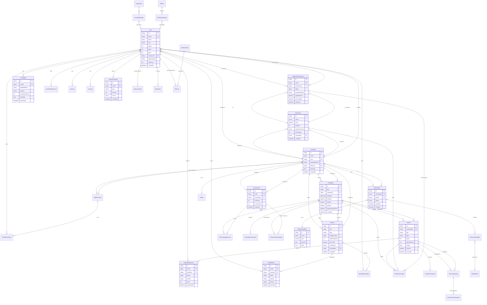

# Database Architecture - VQuest Platform

## Entity-Relationship Diagram



## Main Tables

### 1. User Management and Authentication

#### User
- **Description**: Main system user with multi-role system
- **Roles**: SUPER_ADMIN, COMPANY_ADMIN, CAMPAIGN_CREATOR, END_USER
- **Gamification**: points, gems, level, vipTier
- **Anti-Bot Security**: registrationIp, riskScore, suspensionReason
- **Critical Indexes**: companyId, role, isActive, registrationIp, riskScore

#### Session
- **Description**: Session management with NextAuth.js
- **Indexes**: userId, expires (for automatic cleanup)

#### Account
- **Description**: Linked OAuth accounts (Google, GitHub, etc.)
- **Unique Index**: [provider, providerAccountId]

#### UserWallet
- **Description**: Anti-multi-account system - blockchain wallet tracking
- **Key Fields**: walletAddress, network, transactionCount, riskFlags
- **Critical Indexes**: walletAddress, [walletAddress, network]

#### UserGitHubAccount
- **Description**: GitHub account linking with OAuth
- **Fields**: githubId, githubUsername, accessToken (encrypted)

---

### 2. Multi-tenant and Companies

#### Company
- **Description**: Multi-tenant system with isolation by companyId
- **Fields**: slug, subscriptionTier, branding, customDomain, themeId
- **Relationships**: Users, Campaigns, Rewards, GamePasses, Subscription

#### Subscription
- **Description**: Enterprise subscriptions with plans and addons
- **States**: ACTIVE, CANCELED, PAST_DUE, UNPAID
- **Integration**: Stripe (stripeCustomerId, stripeSubscriptionId)

#### SubscriptionPlan
- **Description**: Subscription plans with features and limits
- **Fields**: price, features (JSON), limits (JSON), yearlyDiscount

#### BillingAddon
- **Description**: Add-ons for subscriptions
- **Fields**: category, compatiblePlans, dependencies, conflicts

---

### 3. Campaigns and Activities

#### Campaign
- **Description**: Main containers for activities
- **Access Control**: isPublic, isCompanyOnly, accessCode, requiresGamePass
- **Gamification**: pointsMultiplier, gemMultiplier, bonusGemsPool
- **Recurrence**: isRecurring, recurrenceType, recurrenceConfig
- **Critical Indexes**: [companyId, isActive], [isPublic, isActive]

#### Activity
- **Description**: Individual tasks within campaigns
- **Types**: FORM, QUIZ, ON_CHAIN_TASK, FILE_UPLOAD, PRESENCE_EVENT, CONTENT, TASK, LAB, SUBMISSION, PROJECT
- **Rewards**: points, gemsReward, levelReward
- **Configuration**: config (JSON), resources (JSON)
- **Critical Indexes**: [campaignId, isActive], [type, isActive]

#### ActivitySubmission
- **Description**: User submissions to activities
- **States**: PENDING, APPROVED, REJECTED, NEEDS_REVIEW
- **Fields**: content, score, feedback, attemptNumber
- **Unique Index**: [userId, activityId]

#### RecurringActivity
- **Description**: Recurring activity configuration
- **Types**: DAILY, WEEKLY, MONTHLY, CUSTOM
- **Tracking**: UserRecurringProgress

---

### 4. Rewards System

#### Reward
- **Description**: Multi-type rewards system
- **Types**: NFT, BADGE, POINTS, GEMS, PHYSICAL, DIGITAL, VOUCHER, TOKEN, SMART_CONTRACT, etc.
- **Categories**: BLOCKCHAIN, DIGITAL, PHYSICAL
- **Marketplace**: priceUSD, acceptedCryptos, availableInStore
- **Indexes**: [type, isActive], [companyId, isActive]

#### UserReward
- **Description**: Rewards assigned to users
- **States**: EARNED, CLAIMED, EXPIRED
- **Blockchain**: tokenId, txHash (for NFTs)
- **Indexes**: [userId, status], [rewardId, status]

#### MarketplaceListing
- **Description**: User-to-user rewards marketplace
- **States**: ACTIVE, SOLD, CANCELLED, EXPIRED
- **Fields**: price (in gems), isNegotiable, minOffer

---

### 5. GamePass System

#### GamePass
- **Description**: Premium pass system for access/benefits
- **Types**: ACCESS, LIVES, MULTIPLIER, REVIVAL, PREMIUM, COOLDOWN_SKIP, DESCUENTOS
- **Payments**: price (USD), cryptoPrice, gemPrice, acceptedCryptos
- **Stock Control**: maxSupply, currentSupply
- **Indexes**: [companyId, isActive], [isActive, price]

#### GamePassPurchase
- **Description**: GamePass purchases with crypto/gems
- **Payment States**: PENDING, CONFIRMED, FAILED, EXPIRED, REFUNDED
- **Activation States**: PURCHASED, ACTIVE, EXPIRED, CONSUMED, PAUSED
- **Fields**: transactionId, walletAddress, expiresAt, usesRemaining
- **Critical Indexes**: [userId, activationStatus], [activationStatus, expiresAt]

#### GamePassUsage
- **Description**: GamePass usage tracking
- **Usage Types**: access, discount, multiplier, revival, bonus_attempts
- **Tracking**: purchaseId, activityId, campaignId, discountApplied

---

### 6. Gems and Transactions System

#### GemTransaction
- **Description**: Record of all gem transactions
- **Types**: EARNED, SPENT, BONUS, REFUND, ADMIN, TRANSFER, EXCHANGE
- **Fields**: amount, source, sourceId, description, metadata
- **Indexes**: [userId, createdAt], [type, createdAt]

#### GemsTransfer
- **Description**: Gem transfers between users
- **States**: PENDING, COMPLETED, FAILED, CANCELLED
- **Fields**: senderId, receiverId, amount, fee, finalAmount

#### GemsConfig
- **Description**: Gems system configuration
- **Structure**: [category, key] → value
- **Examples**: exchange_rate, transfer_fee, daily_bonus

---

### 7. Digital Products

#### DigitalProduct
- **Description**: Sellable digital products (gem packages, tickets, etc.)
- **Types**: GEM_PACKAGE, TICKET, SUBSCRIPTION
- **Payments**: priceUSD, gemPrice, acceptedCryptos
- **Indexes**: [type, isActive], [priceUSD]

#### ProductPurchase
- **Description**: Digital product purchase history
- **States**: PENDING, CONFIRMED, FAILED, EXPIRED, REFUNDED
- **Fields**: cryptoAmount, cryptoSymbol, exchangeRate, txHash

---

### 8. Cryptocurrency Configuration

#### CryptoConfig
- **Description**: Accepted cryptocurrency configuration
- **Purposes**: GAMEPASS_PAYMENT, REWARD_PAYMENT, GEM_EXCHANGE, BOTH
- **Fields**: currency, network, chainId, walletAddress, contractAddress
- **Integration**: coinGeckoId, priceAPI (for USD conversion)
- **Unique Index**: [currency, purpose, network]

---

### 9. Access Control

#### AccessCode
- **Description**: Access codes for campaigns/events
- **Types**: CAMPAIGN, EVENT, COMPANY, GENERAL
- **Control**: maxUses, currentUses, expiresAt
- **Unique Index**: code

#### UserCampaignAccess
- **Description**: User campaign access record
- **Types**: public, code, company, gamepass
- **Unique Index**: [userId, campaignId]

#### CampaignPrerequisite / ActivityPrerequisite
- **Description**: Chained prerequisite system
- **Unique Index**: [campaignId, requiredCampaignId] / [activityId, requiredActivityId]

---

### 10. Referral System

#### ReferralCode
- **Description**: Referral codes with rewards
- **Fields**: referrerReward, referredReward, grantsVipTier, vipDuration
- **Control**: maxUses, currentUses, expiresAt

#### Referral
- **Description**: Referral record
- **States**: PENDING, COMPLETED, EXPIRED
- **Unique Index**: [referrerId, referredId]

---

### 11. Competitions and A/B Testing

#### Competition
- **Description**: Gamified competition system
- **Types**: POINTS_RACE, ACTIVITY_SPEED, STREAK_LONGEST, GEMS_EARNED
- **States**: UPCOMING, ACTIVE, FINISHED, CANCELLED
- **Fields**: prizePool, prizeDistribution (JSON), entryFee

#### CompetitionEntry
- **Description**: Competition participation
- **Fields**: score, position, prizesEarned
- **States**: ACTIVE, DISQUALIFIED, COMPLETED

#### ABTest
- **Description**: A/B tests for optimization
- **States**: DRAFT, RUNNING, PAUSED, COMPLETED, CANCELLED
- **Fields**: variants, trafficSplit, primaryMetric, secondaryMetrics

#### ABTestParticipant
- **Description**: User assignment to variants
- **Unique Index**: [testId, userId]

---

### 12. Internationalization

#### Translation
- **Description**: Translations stored in database
- **Fields**: originalText, translatedText, sourceLanguage, targetLanguage
- **Approval**: isApproved, approvedBy, approvedAt, quality
- **Unique Index**: [modelName, recordId, fieldName, targetLanguage]

#### TranslationJob
- **Description**: Automatic translation jobs
- **States**: PENDING, IN_PROGRESS, COMPLETED, FAILED, CANCELLED
- **Fields**: targetLanguages, completedLanguages, failedLanguages, attempts

---

### 13. Marketing and Public Resources

#### Marketing
- **Description**: Banners, popups, promotions
- **Types**: banner, popup, notification, promotion
- **Fields**: translations (multi-language JSON), config, order

#### PublicResource
- **Description**: Publicly shareable resources (presentations, videos)
- **Fields**: slug (custom URL), fileUrl, fileType, downloads
- **Unique Index**: slug

---

### 14. Audit and Logs

#### AuditLog
- **Description**: Complete record of system changes
- **Fields**: action, entityType, entityId, changes (JSON), performedBy
- **Metadata**: ipAddress, userAgent, timestamp
- **Indexes**: [action], [entityType, entityId], [performedBy], [timestamp]

#### UserActivity
- **Description**: User activity in the system
- **Fields**: action, entityType, entityId, metadata
- **Indexes**: [userId, timestamp], [action, timestamp]

#### FacebookEventLog
- **Description**: Logs of events sent to Facebook Pixel
- **Fields**: eventName, eventId, fbTraceId, success, errorMessage
- **Indexes**: [eventName, createdAt], [success, createdAt]

---

### 15. Bonus System

#### UserSpinBonus
- **Description**: Spin packages for prize wheel
- **Fields**: spinsAmount, spinsUsed, source, expiresAt
- **Indexes**: [userId, expiresAt], [userId, source]

---

## Critical Performance Indexes

### Users
- `[companyId]` - Users per company (multi-tenant)
- `[role]` - Filter by role
- `[isActive]` - Active users only
- `[registrationIp]` - Anti-bot detection
- `[riskScore]` - Sort by risk

### Campaigns
- `[companyId, isActive]` - Active campaigns by company
- `[isPublic, isActive]` - Active public campaigns
- `[isActive, startDate]` - Campaigns sorted by date

### Activities
- `[campaignId, isActive]` - Active activities by campaign
- `[type, isActive]` - Filter by activity type
- `[order, createdAt]` - Sort in listings

### Submissions
- `[userId, activityId]` - Unique participation verification
- `[userId, status]` - Submissions by user status
- `[activityId, status]` - Statistics by activity
- `[status, submittedAt]` - Sort by date

### Rewards
- `[type, isActive]` - Filter by active type
- `[companyId, isActive]` - Rewards by company
- `[userId, status]` - UserRewards by status

### GamePass
- `[companyId, isActive]` - GamePasses by company
- `[isActive, price]` - Sort by price
- `[userId, activationStatus]` - Activation status by user
- `[activationStatus, expiresAt]` - Active/expired GamePasses

### Wallets (Anti-Bot)
- `[walletAddress]` - **CRITICAL**: Search by wallet
- `[walletAddress, network]` - **CRITICAL**: Wallet in specific network
- `[userId, lastUsedAt]` - Wallets by user

---

## Key Relationships

### Multi-tenant (Company-based)
```
Company → Users
Company → Campaigns → Activities → Submissions
Company → Rewards
Company → GamePasses
Company → DigitalProducts
Company → Subscription
```

### Gamification Flow
```
User completes Activity → ActivitySubmission (APPROVED)
→ User gains points/gems/levels
→ UserReward earned
→ Optional: MarketplaceListing (trade reward)
```

### GamePass System
```
User → GamePassPurchase (crypto/gems)
→ Activation → GamePassUsage (per campaign/activity)
→ Benefits: access, multipliers, bonus attempts, revival
```

### Anti-Bot / Security
```
User registration → registrationIp stored
User connects wallet → UserWallet created
System checks: walletAddress duplicates, IP duplicates
System assigns: riskScore
Admin reviews: suspensionReason, suspendedAt
```

---

## Important Enum Types

- **UserRole**: SUPER_ADMIN, COMPANY_ADMIN, CAMPAIGN_CREATOR, END_USER
- **ActivityType**: FORM, QUIZ, ON_CHAIN_TASK, FILE_UPLOAD, PRESENCE_EVENT, CONTENT, TASK, LAB, SUBMISSION, PROJECT
- **SubmissionStatus**: PENDING, APPROVED, REJECTED, NEEDS_REVIEW
- **RewardCategory**: BLOCKCHAIN, DIGITAL, PHYSICAL
- **GamePassType**: ACCESS, LIVES, MULTIPLIER, REVIVAL, PREMIUM, COOLDOWN_SKIP, DESCUENTOS
- **CryptoPaymentStatus**: PENDING, CONFIRMED, FAILED, EXPIRED, REFUNDED
- **GamePassActivationStatus**: PURCHASED, ACTIVE, EXPIRED, CONSUMED, PAUSED
- **TransactionType**: EARNED, SPENT, BONUS, REFUND, ADMIN, TRANSFER, EXCHANGE
- **RecurrenceType**: DAILY, WEEKLY, MONTHLY, CUSTOM

---

## Scalability Considerations

1. **Company Partitioning**: All main queries include `companyId` for multi-tenant isolation
2. **Composite Indexes**: Optimized for common queries (e.g., `[companyId, isActive]`)
3. **Soft deletes**: `deletedAt` allows recovery and auditing
4. **JSON fields**: Config, metadata, branding allow extensibility without migrations
5. **Redis caching**: For frequently accessed data (user sessions, company settings)
6. **Timestamp indexes**: For automatic cleanup (expired sessions, old notifications)
